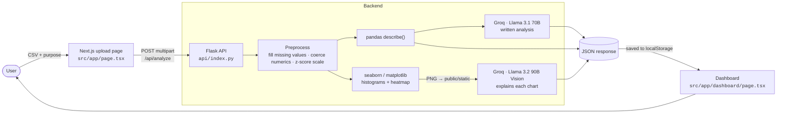

<p align="center">
  
</p>

<p align="center">
  
  
  
  
  
  
  
</p>

<p align="center">
  <b>AutoVisual</b> turns a raw CSV into a readable report.<br/>
  Upload your data, say what you need it for, and you get a written analysis, a chart for every numeric column,<br/>
  and a vision model's explanation of each chart.
</p>

---

## Contents

- [What it is](#what-it-is)
- [How it works](#how-it-works)
- [Features](#features)
- [Tech stack](#tech-stack)
- [Project structure](#project-structure)
- [Getting started](#getting-started)
- [Using it](#using-it)
- [API reference](#api-reference)
- [Sample datasets](#sample-datasets)
- [Known limitations](#known-limitations)
- [Roadmap](#roadmap)

---

## What it is

Exploring a new dataset usually means the same steps every time: load it, run `describe()`, plot the distributions, look at correlations, and write up what you found. AutoVisual automates those steps.

You give it two things:

1. **A data file** (CSV).
2. **A purpose**, in plain English, such as *"To report 3rd quarter annual report"* or *"Find out which airlines land the heaviest aircraft"*.

You get back an **AI-powered dashboard** with:

- **A written analysis.** It describes the dataset, points out trends, correlations and anomalies, suggests real-world uses and models, analyses each variable, recommends validation checks, and suggests visualisations. The purpose you gave shapes all of it.
- **Generated charts.** You get a histogram with a KDE curve for every numeric column, plus a correlation heatmap when there are two or more numeric columns.
- **An explanation of every chart.** Each chart image goes to a multimodal (vision) LLM, which describes what the chart shows. Each chart is displayed next to its explanation.

> 🎬 **Demo:** a screen recording of the full flow is in the repo, at [`2024-12-22-05-48-05.mp4`](./2024-12-22-05-48-05.mp4).

---

## How it works



**Step by step:**

| # | Stage | What happens | Where |
|---|-------|--------------|-------|
| 1 | **Upload** | The user picks a file and writes a purpose. Both are sent as `multipart/form-data`. | [`src/app/page.tsx`](src/app/page.tsx) |
| 2 | **Preprocess** | Text columns get their missing values filled with the mode. Every other column is converted to numbers, filled with the mean, then z-score standardised. | `preprocess_data()` in [`api/index.py`](api/index.py) |
| 3 | **Summarise** | `DataFrame.describe(include='all')` builds a statistical summary of every column. | `analyze_data()` |
| 4 | **Analyse** | The summary and the purpose go to a Llama 3.1 70B model on Groq. A detailed system prompt asks for a description, trends, applications, per-variable analysis, validation checks and chart suggestions. | `generate_insights_and_tests()` |
| 5 | **Plot** | seaborn draws a histogram with KDE for each numeric column, plus a correlation heatmap. The PNGs are written to `public/static/` so Next.js can serve them. | `generate_plots()` |
| 6 | **Explain the charts** | Each PNG is base64-encoded and sent to Llama 3.2 90B Vision, which describes what the chart shows. | `img_inference()` |
| 7 | **Render** | The frontend saves the JSON response in `localStorage` and opens `/dashboard`. The dashboard renders the analysis as Markdown and shows each chart beside its explanation. | [`src/app/dashboard/page.tsx`](src/app/dashboard/page.tsx), [`VisualizationAndInsights.tsx`](src/app/components/VisualizationAndInsights.tsx) |

---

## Features

- 📤 **Upload a file and state a purpose.** The purpose steers the analysis, so the same data gets a different write-up for a different goal.
- 🧹 **Automatic cleaning.** Missing values are filled, non-numeric values are coerced, and numeric columns are standardised.
- 🧠 **LLM-written analysis.** Covers trends, correlations, anomalies, real-world uses, per-variable analysis and suggested validation tests, rendered as Markdown.
- 📊 **Automatic charts.** A distribution plot for every numeric feature and a correlation heatmap for the dataset.
- 👁️ **Vision-model chart explanations.** Every chart comes with an explanation written by a multimodal model that looked at the image.
- 🌗 **A clean, responsive UI.** Built with Next.js App Router, Tailwind and shadcn-style components (Card, Button, Input, Select, Textarea).

---

## Tech stack

| Layer | Tools |
|-------|-------|
| **Frontend** | [Next.js 15](https://nextjs.org) (App Router, Turbopack), React 18, TypeScript, Tailwind CSS, Radix UI, `react-markdown`, Chart.js / `react-chartjs-2`, `lucide-react` |
| **Backend** | Python, Flask, `flask-cors`, pandas, matplotlib, seaborn |
| **AI** | [Groq](https://groq.com) inference API: `llama-3.1-70b-versatile` writes the analysis, `llama-3.2-90b-vision-preview` explains the charts |
| **Experiments** | LangChain, Hugging Face `transformers`, Qwen2.5-Coder-3B and StarCoder, used for local-model prototypes (see below) |

---

## Project structure

```
autovisual/
├── api/                              # Python backend
│   ├── index.py                      # ⭐ Flask app: /api/analyze, preprocessing, plots, LLM calls
│   ├── grogApi.py                    # prototype: Groq text analysis on a CSV summary
│   ├── flaskwithLangchain.py         # prototype: Groq vision call on a single chart image
│   ├── app.py                        # experiment: LangChain + local HF models (Qwen2.5-Coder, StarCoder)
│   ├── pipeline.py                   # experiment: local Qwen2.5-Coder inference / code generation
│   ├── data.csv                      # sample dataset: roulette rounds
│   └── Air_Traffic_Landings_Statistics.csv   # sample dataset: SFO landings
│
├── src/app/                          # Next.js frontend (App Router)
│   ├── page.tsx                      # upload page: file + purpose form
│   ├── dashboard/page.tsx            # dashboard: AI analysis + charts with explanations
│   ├── components/
│   │   ├── VisualizationAndInsights.tsx   # chart ↔ explanation card grid
│   │   └── ui/                       # button, card, input, label, select, textarea
│   ├── layout.tsx
│   └── globals.css
│
├── public/static/                    # charts generated by the backend (served at /static)
├── docs/assets/header.svg            # README banner
├── next.config.ts                    # dev rewrite /api/* → Flask
└── package.json
```

---

## Getting started

### Prerequisites

- **Node.js 18+** and **pnpm** (npm works too)
- **Python 3.9+**
- A **Groq API key** (free at [console.groq.com](https://console.groq.com))

### 1. Clone

```bash
git clone https://github.com/mks2122/autovisual.git
cd autovisual
```

### 2. Backend

```bash
python -m venv .venv
# Windows: .venv\Scripts\activate   |   macOS/Linux: source .venv/bin/activate

pip install flask flask-cors pandas matplotlib seaborn groq
```

> The checked-in `requirements.txt` is a snapshot from the local-model experiments (torch, transformers, LangChain). It doesn't include the Flask app's dependencies, so use the command above for the main app.

Set your Groq key. The Flask app creates its client near the top of [`api/index.py`](api/index.py). The safest option is to read the key from an environment variable:

```python
client = Groq(api_key=os.environ["GROQ_API_KEY"])
```

```bash
# Windows (PowerShell):  $env:GROQ_API_KEY="gsk_..."
export GROQ_API_KEY="gsk_..."
```

Start the API **from the repository root**. Charts are written to `public/static/` relative to the current directory, and Next.js serves them from there.

```bash
python api/index.py          # serves on http://127.0.0.1:5000
```

### 3. Frontend

In a second terminal:

```bash
pnpm install
pnpm dev                     # serves on http://localhost:3000
```

Open **http://localhost:3000**.

---

## Using it

1. Under **State the Purpose of Data Analysis**, describe what you want to learn, for example *"Understand landing trends by aircraft type"*.
2. Under **File Upload**, pick a CSV. You can try [`api/data.csv`](api/data.csv) or [`api/Air_Traffic_Landings_Statistics.csv`](api/Air_Traffic_Landings_Statistics.csv).
3. Click **Process Data**. The backend makes one LLM call for the analysis plus one vision call per chart, so wide datasets take a little longer.
4. The **Dynamic AI-Powered Dashboard** opens:
   - **Insights and Tests**: the full written analysis.
   - **Visualization**: each generated chart with its **AI Insights** card beside it.

---

## API reference

### `POST /api/analyze`

`multipart/form-data`

| Field | Type | Required | Description |
|-------|------|:--------:|-------------|
| `file` | file (CSV) | ✅ | The dataset to analyse (max 10 MB) |
| `purpose` | string | ✅ | What the analysis is for. It steers the LLM. |

**Response `200`**

```jsonc
{
  "summary": {                       // describe() stats per column (numeric values only)
    "Landing Count": { "count": 1234, "mean": 0, "std": 1, "min": -1, ... }
  },
  "insights_and_tests": "## Description\n...",   // Markdown analysis from the LLM
  "generated_plots": [
    ["/static/Landing Count_histogram.png", "This histogram shows ..."],
    ["/static/correlation_heatmap.png",     "The heatmap indicates ..."]
  ]
}
```

**Errors:** `400` if the file or purpose is missing, `500` with `{ "error": "..." }` for anything else.

```bash
curl -X POST http://127.0.0.1:5000/api/analyze \
  -F "file=@api/data.csv" \
  -F "purpose=Find patterns in roulette outcomes"
```

---

## Sample datasets

| File | What's in it |
|------|--------------|
| [`api/data.csv`](api/data.csv) | Simulated roulette rounds: winning number and colour, plus win flags for red, black, even, odd and zero bets |
| [`api/Air_Traffic_Landings_Statistics.csv`](api/Air_Traffic_Landings_Statistics.csv) | San Francisco International Airport landings by airline, region, aircraft type, manufacturer and model, with landing count and total landed weight |

Charts already generated from both datasets are in [`public/static/`](public/static/).

---

## Known limitations

These are honest notes for anyone picking up the code.

- **CSV only.** The backend uses `pd.read_csv`. Excel and JSON uploads aren't handled yet.
- **The "file URL" field on the upload page isn't wired up.** Only uploaded files are processed.
- **The data is standardised before it's summarised.** The z-score step runs before `describe()` and plotting, so the LLM and the histograms see scaled values (mean ≈ 0, std ≈ 1), not the original units.
- **Port mismatch.** The frontend calls `http://127.0.0.1:5000`, the port `python api/index.py` uses. The `flask-dev` npm script and the `next.config.ts` rewrite both point at port `8000`. If you run Flask through `pnpm flask-dev`, change the URL in `page.tsx` to match.
- **Model names may be outdated.** Groq retires preview models from time to time. If a call fails with a model-not-found error, replace `llama-3.1-70b-versatile` and `llama-3.2-90b-vision-preview` in `api/index.py` with current models from the [Groq model list](https://console.groq.com/docs/models).
- **Results are passed through `localStorage`.** Refreshing the dashboard shows the last result, and very large responses can hit browser storage limits.
- **Chart files are overwritten.** Charts are named after their column, so a new dataset with the same column names replaces the old charts.

---

## Roadmap

- [ ] Accept Excel and JSON uploads, and fetch a dataset from a URL
- [ ] Read API keys from environment variables or a `.env` file
- [ ] Summarise the raw data first, and scale it only for modelling
- [ ] Interactive Chart.js charts generated from the LLM's chart suggestions
- [ ] Stream the analysis and chart explanations as they're produced
- [ ] Use one config for the API port and drop the hardcoded URLs
- [ ] Export the dashboard as PDF or Markdown

---

<p align="center">
  Built by <a href="https://github.com/mks2122">@mks2122</a> · Next.js + Flask + Groq
</p>
